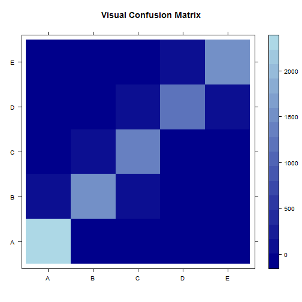

# Introduction

This document describes a qualitative analysis of a certain weight lifting exercise. It was created in the context of a Coursera Peer Assessment in the Practical Machine Learning course of the JHU Data Science specialization. Some of the text found in this document originates from the [assignment page](https://class.coursera.org/predmachlearn-035/human_grading/view/courses/975205/assessments/4/submissions).


## Background

Using devices such as Jawbone Up, Nike FuelBand, and Fitbit it is now possible to collect a large amount of data about personal activity relatively inexpensively. These type of devices are part of the quantified self movement - a group of enthusiasts who take measurements about themselves regularly to improve their health, to find patterns in their behavior, or because they are tech geeks. One thing that people regularly do is quantify how much of a particular activity they do, but they rarely quantify how well they do it. In this project, the goal is to use data from accelerometers on the belt, forearm, arm, and dumbell of 6 participants. They were asked to perform barbell lifts correctly and incorrectly in 5 different ways: 

* Exactly according to the specification (Class A), 
* Throwing the elbows to the front (Class B), 
* Lifting the dumbbell only halfway (Class C), 
* Lowering the dumbbell only halfway (Class D),
* Throwing the hips to the front (Class E).


More information is available on the [website of the original study](http://groupware.les.inf.puc-rio.br/har). 

## Downloading and Reading the Data

The original source of the data in this project can be found [here](http://groupware.les.inf.puc-rio.br/har).
The training data used in this project are available [here](https://d396qusza40orc.cloudfront.net/predmachlearn/pml-training.csv), and the test data are available [here](https://d396qusza40orc.cloudfront.net/predmachlearn/pml-testing.csv).
The following code chunk downloads the data (if not already present in .csv format), then reads this data, and caches this result afterwards. Values matching *"#DIV/0!"* will be read in as missing values to avoid those features being read in as factors.


```r
fileTrain <- "pml-training.csv"
fileValidation <- "pml-testing.csv"
# Check if the data is present, otherwise download it
if (!file.exists(fileTrain) | !file.exists(fileValidation)) {
     download.file("https://d396qusza40orc.cloudfront.net/predmachlearn/pml-training.csv", fileTrain) 
     download.file("https://d396qusza40orc.cloudfront.net/predmachlearn/pml-testing.csv", fileValidation) 
}
trainFull <- read.csv(fileTrain,na.strings=c("NA","#DIV/0!"))
validation <- read.csv(fileValidation,na.strings=c("NA","#DIV/0!"))
# Show some of the data
trainFull[1:6,1:5]
```

```
##   X user_name raw_timestamp_part_1 raw_timestamp_part_2   cvtd_timestamp
## 1 1  carlitos           1323084231               788290 05/12/2011 11:23
## 2 2  carlitos           1323084231               808298 05/12/2011 11:23
## 3 3  carlitos           1323084231               820366 05/12/2011 11:23
## 4 4  carlitos           1323084232               120339 05/12/2011 11:23
## 5 5  carlitos           1323084232               196328 05/12/2011 11:23
## 6 6  carlitos           1323084232               304277 05/12/2011 11:23
```
## Creating a Test Set
The dataset comes with a supplied test set, however, the *classe* label for these values is not included. As a result, we will be treating the supplied test set as a validation set, and partition the supplied training set into a training and testing set. The seed is set to allow for consistent results.


```r
set.seed(12345)
inTrain <- createDataPartition(trainFull$classe, p = .6, list = FALSE)
training <- trainFull[inTrain,]
testing <- trainFull[-inTrain,]
```


## Data Preprocessing: Selecting the Predictors
The original dataset contains 160 columns, some of which are more useful than others. There are many tests we can apply to test for usefulness, however, we must be careful to only look at the training data when doing so. After we have made a selection of useful predictors based on the training data, the same subset must be used for the test data. The following code chunk performs a first selection of predictors, throwing away those predictors that have a near zero variance. There is some [debate](http://www.r-bloggers.com/near-zero-variance-predictors-should-we-remove-them/) as to whether zero variance predictors should always be removed, but for this project we have chosen to do so. In addition, we will be omitting the first 7 columns:

``X, user_name, raw_timestamp_part_1, raw_timestamp_part_2, cvtd_timestamp, new_window, num_window`` 

As they contain information a typical model should not be using. After all, the experiment setup could have the subjects execute the exercise classes in a specific order, for example, which is not something we want to include in our model.


```r
predictorsTrain1 <- training[,-(1:7)]
predictorsTest1 <- testing[,-(1:7)]
predictorsVal1 <- validation[,-(1:7)]
nzvTrain <- nearZeroVar(predictorsTrain1,saveMetrics = TRUE)$nzv
predictorsTrain2 <- predictorsTrain1[,nzvTrain==FALSE]
# Use training data metrics to subset test and validation set!
predictorsTest2 <- predictorsTest1[,nzvTrain==FALSE] 
predictorsVal2 <- predictorsVal1[,nzvTrain==FALSE]
```
Next, we will be removing those predictors that have missing values in the training set. Note that this constitutes removing *columns*, not rows, with missing values. There are many thousands of missing values, but most are constituted by a few columns that are nearly fully NA. Thus, it is ok to remove these columns - but not all those rows, as this would be removing useful information. There appear to be no columns with only a few NAs: either they are nearly all NA or there are none. Otherwise, if there were a limited amount of NA values it would be interesting to delete those rows. However, with the given data it seems removing the useless columns is better.


```r
noNAsTrain = sapply(predictorsTrain2,function(x) sum(is.na(x))) == 0
predictorsTrain3 <- predictorsTrain2[,noNAsTrain==TRUE]
predictorsTest3 <- predictorsTest2[,noNAsTrain==TRUE]
predictorsVal3 <- predictorsVal2[,noNAsTrain==TRUE]
```

Finally, we take out the class label:


```r
classTrain <- predictorsTrain3$classe
predictorsTrainFinal <- predictorsTrain3[,names(predictorsTrain3)!="classe"]
classTest <- predictorsTest3$classe
predictorsTestFinal <- predictorsTest3[,names(predictorsTest3)!="classe"]
predictorsValFinal <- predictorsVal3
```

# Analysis: Qualitative Activity Recognition
## Model Building
We will be using the [Random Forests](https://en.wikipedia.org/wiki/Random_forest) algorithm by using the R package *caret*'s function *train()* with *method=rf*. Please note that we will not be using the formula notation, as it is [highly inefficient](http://stackoverflow.com/questions/6449588/r-memory-management-advice-caret-model-matrices-data-frames/6555053#6555053). Before fitting the model, the data is preprocessed by normalization through centering and scaling. In addition, 10-fold cross validation is applied to detect and prevent overfitting, as *caret*'s function *train()* handles this for us. Cross validation is especially necessary for random forests models, as they are sensitive to overfitting on top of their long execution time. The seed is set to ensure consistent results.

```r
set.seed(12345)
model <- train(x = predictorsTrainFinal, y = classTrain, method = "rf",
               na.action = na.omit, preProcess = c("center", "scale"),
               trControl = trainControl(method = "cv"), allowParallel = TRUE)
print(model)
```

```
## Random Forest 
## 
## 11776 samples
##    52 predictor
##     5 classes: 'A', 'B', 'C', 'D', 'E' 
## 
## Pre-processing: centered (52), scaled (52) 
## Resampling: Cross-Validated (10 fold) 
## Summary of sample sizes: 10598, 10599, 10600, 10599, 10598, 10599, ... 
## Resampling results across tuning parameters:
## 
##   mtry  Accuracy   Kappa      Accuracy SD  Kappa SD   
##    2    0.9898112  0.9871109  0.003296088  0.004169473
##   27    0.9897256  0.9870030  0.002923664  0.003699717
##   52    0.9867531  0.9832420  0.002629188  0.003327297
## 
## Accuracy was used to select the optimal model using  the largest value.
## The final value used for the model was mtry = 2.
```
To illustrate the model we have now created, we plot the importance of each variable in the final model to give us some insight. Note that this plot uses the [Gini impurity](https://en.wikipedia.org/wiki/Decision_tree_learning#Gini_impurity), which is a measure of node impurity. Simply said, it is a measure of how often a randomly chosen element from the set would be incorrectly labeled if it were randomly labeled according to the distribution of labels in the subset. A [higher decrease in Gini](http://stackoverflow.com/questions/736514/r-random-forests-variable-importance) means that a particular predictor variable plays a greater role in partitioning the data into the defined classes.

```r
varImpPlot(model$finalModel,main="Variable Importance Plot",pch=19)
title(xlab="Variable Importance for Data Partitioning\n")
```

 


## Model Evaluation
In evaluating the model, we differentiate between in sample error, also called resubstitution error, and out of sample error, sometimes called generalization error. In sample errors are generally a bit more optimistic than out of sample errors due to overfitting. However, it is important to note that the out-of-bag (OOB) error estimate is an exception to this rule, as it has a [slight pessimistic tendency](http://stats.stackexchange.com/questions/105811/how-would-one-formally-prove-that-the-oob-error-in-random-forest-is-unbiased). This small pessimistic bias is due to the fact that OOB error estimates are calculated on training sets that are (at least) one training case smaller than the full training set. We will now be studying the in sample and out of sample error estimates.

### In Sample Error
To evaluate the final model created by the random forests algorithm, we first print it to examine which metrics are already available.

```r
print(model$finalModel)
```

```
## 
## Call:
##  randomForest(x = x, y = y, mtry = param$mtry, na.action = ..1,      allowParallel = TRUE) 
##                Type of random forest: classification
##                      Number of trees: 500
## No. of variables tried at each split: 2
## 
##         OOB estimate of  error rate: 0.99%
## Confusion matrix:
##      A    B    C    D    E class.error
## A 3343    3    2    0    0 0.001493429
## B   18 2247   14    0    0 0.014041246
## C    1   16 2032    5    0 0.010710808
## D    0    0   44 1882    4 0.024870466
## E    0    0    2    7 2156 0.004157044
```
We note an out-of-bag (OOB) error estimate of < 1%, and a good looking confusion matrix. However, the OOB error and the confusion matrix shown above are calculated on the training set. We will now be looking at the performance on the created test set to evaluate the model on true out of sample data.

### Out of Sample Error
First, we use the model to predict the class labels for the test set, then, we compare it to their true labels. This is done using the confusion matrix as shown below:


```r
predictions <- predict(model, predictorsTestFinal) 
confM <- confusionMatrix(predictions, classTest)
confM
```

```
## Confusion Matrix and Statistics
## 
##           Reference
## Prediction    A    B    C    D    E
##          A 2230   11    0    0    0
##          B    2 1504   10    0    0
##          C    0    3 1357   23    2
##          D    0    0    1 1260    4
##          E    0    0    0    3 1436
## 
## Overall Statistics
##                                           
##                Accuracy : 0.9925          
##                  95% CI : (0.9903, 0.9943)
##     No Information Rate : 0.2845          
##     P-Value [Acc > NIR] : < 2.2e-16       
##                                           
##                   Kappa : 0.9905          
##  Mcnemar's Test P-Value : NA              
## 
## Statistics by Class:
## 
##                      Class: A Class: B Class: C Class: D Class: E
## Sensitivity            0.9991   0.9908   0.9920   0.9798   0.9958
## Specificity            0.9980   0.9981   0.9957   0.9992   0.9995
## Pos Pred Value         0.9951   0.9921   0.9798   0.9960   0.9979
## Neg Pred Value         0.9996   0.9978   0.9983   0.9960   0.9991
## Prevalence             0.2845   0.1935   0.1744   0.1639   0.1838
## Detection Rate         0.2842   0.1917   0.1730   0.1606   0.1830
## Detection Prevalence   0.2856   0.1932   0.1765   0.1612   0.1834
## Balanced Accuracy      0.9986   0.9944   0.9938   0.9895   0.9977
```
Notably, we see an accuracy of 99.2480245% for out of sample data, with a very significant P-value. Again, we see a good looking confusion matrix, which we now visualize with colours. 

```r
new.palette=colorRampPalette(c("darkblue","lightblue"),space="rgb") 
plot(levelplot(confM$table,main ="Visual Confusion Matrix",xlab=NULL,ylab=NULL,col.regions=new.palette(100)))
```

 


# Validation Set
The following code chunk was used to generate the answers for the validation set, also known as the originally provided testing set. The instruction for generating the files has been commented out, and the answers are printed instead.


```r
# The validation part of the assigment
pml_write_files = function(x){
  n = length(x)
  for(i in 1:n){
    filename = paste0("problem_id_",i,".txt")
    write.table(x[i],file=filename,quote=FALSE,row.names=FALSE,col.names=FALSE)
  }
}
predictionsVal <- predict(model, predictorsValFinal)
answers <- as.character(predictionsVal)
answers
#pml_write_files(answers)
```

```
##  [1] "B" "A" "B" "A" "A" "E" "D" "B" "A" "A" "B" "C" "B" "A" "E" "E" "A"
## [18] "B" "B" "B"
```

# Appendix

## Software Environment
This section describes the software environment in which this assignment was created. The described environment is not the only one in which this report will work, but proper operation is not guaranteed for divergent systems.

* **Computer Architecture:** Intel Core i7 CPU, Intel HD Graphics GPU
* **Operating System:** 64-bit Windows 8
* **Software Toolchain:** R Studio
* **Supporting Software:** R packages: *caret*, *rattle*, *doParallel*, *randomForest* as loaded below

```r
library(caret)
library(rattle)
library(doParallel)
library(randomForest)
```
* **Dependencies:** The data should be stored in the same folder as this file, otherwise it will be downloaded again.

The following R command prints further session info details.

```r
sessionInfo()
```

```
## R version 3.2.3 (2015-12-10)
## Platform: x86_64-w64-mingw32/x64 (64-bit)
## Running under: Windows >= 8 x64 (build 9200)
## 
## locale:
## [1] LC_COLLATE=Dutch_Belgium.1252  LC_CTYPE=Dutch_Belgium.1252   
## [3] LC_MONETARY=Dutch_Belgium.1252 LC_NUMERIC=C                  
## [5] LC_TIME=Dutch_Belgium.1252    
## 
## attached base packages:
## [1] parallel  stats     graphics  grDevices utils     datasets  methods  
## [8] base     
## 
## other attached packages:
## [1] randomForest_4.6-12 doParallel_1.0.10   iterators_1.0.8    
## [4] foreach_1.4.3       rattle_4.0.5        caret_6.0-62       
## [7] ggplot2_2.0.0       lattice_0.20-33     knitr_1.11         
## 
## loaded via a namespace (and not attached):
##  [1] Rcpp_0.12.2        compiler_3.2.3     formatR_1.2.1     
##  [4] nloptr_1.0.4       plyr_1.8.3         class_7.3-14      
##  [7] bitops_1.0-6       tools_3.2.3        rpart_4.1-10      
## [10] digest_0.6.8       lme4_1.1-10        evaluate_0.8      
## [13] gtable_0.1.2       nlme_3.1-122       mgcv_1.8-9        
## [16] Matrix_1.2-3       yaml_2.1.13        SparseM_1.7       
## [19] e1071_1.6-7        RGtk2_2.20.31      stringr_1.0.0     
## [22] MatrixModels_0.4-1 stats4_3.2.3       grid_3.2.3        
## [25] nnet_7.3-11        rmarkdown_0.8.1    minqa_1.2.4       
## [28] reshape2_1.4.1     car_2.1-1          magrittr_1.5      
## [31] whisker_0.3-2      scales_0.3.0       codetools_0.2-14  
## [34] htmltools_0.2.6    MASS_7.3-45        splines_3.2.3     
## [37] rsconnect_0.4.1.4  pbkrtest_0.4-4     colorspace_1.2-6  
## [40] quantreg_5.19      stringi_1.0-1      slidify_0.5       
## [43] RCurl_1.95-4.7     munsell_0.4.2      markdown_0.7.7
```

## References
* Velloso, E.; Bulling, A.; Gellersen, H.; Ugulino, W.; Fuks, H. Qualitative Activity Recognition of Weight Lifting Exercises. Proceedings of 4th International Conference in Cooperation with SIGCHI (Augmented Human '13) . Stuttgart, Germany: ACM SIGCHI, 2013.
* http://groupware.les.inf.puc-rio.br/har
* http://stackoverflow.com/questions/6449588/r-memory-management-advice-caret-model-matrices-data-frames/6555053#6555053
* http://www.r-bloggers.com/near-zero-variance-predictors-should-we-remove-them/
* https://en.wikipedia.org/wiki/Random_forest
* http://stackoverflow.com/questions/736514/r-random-forests-variable-importance
* http://stats.stackexchange.com/questions/105811/how-would-one-formally-prove-that-the-oob-error-in-random-forest-is-unbiased
* https://en.wikipedia.org/wiki/Decision_tree_learning#Gini_impurity

